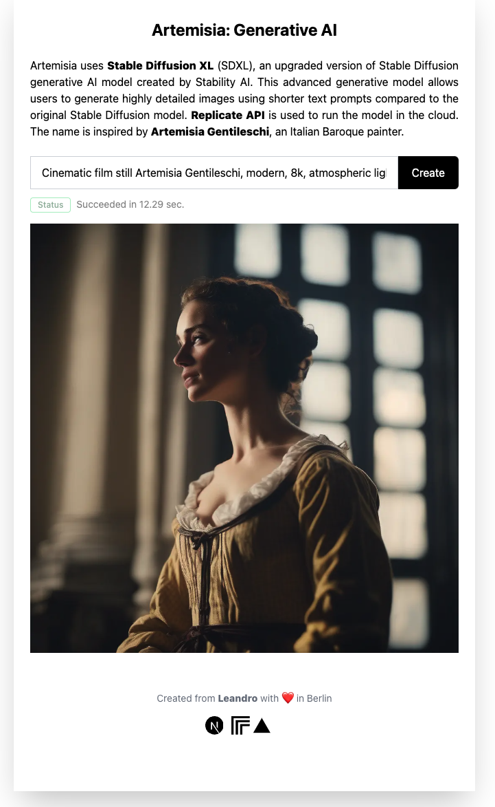

## Getting started with Next.js and Replicate

This webapp was created using a [Next.js](https://nextjs.org/) template project that's preconfigured to work with [Replicate's API](replicate.com/docs/get-started/nextjs). It also use [Tailwind](https://tailwindcss.com/) utility-first CSS framwork.


## Noteworthy files

- [pages/index.js](pages/index.js) - The React frontend that renders the home page in the browser
- [pages/api/predictions/index.js](pages/api/predictions/index.js) - The backend API endpoint that calls Replicate's API to create a prediction
- [pages/api/predictions/[id].js](pages/api/predictions/[id].js) - The backend API endpoint that calls Replicate's API to get the prediction result

## Usage

Clone this repository

```

```

Install dependencies:

```console
npm install
```

Add your [Replicate API token](https://replicate.com/account#token) to `.env.local`:

```
REPLICATE_API_TOKEN=<your-token-here>
```

Run the development server:

```console
npm run dev
```

Open [http://localhost:3000](http://localhost:3000) with your browser.

### Screenshot


